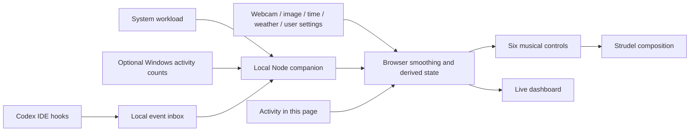

# systrudel

**Your workday, played as a live soundscape.**

systrudel uses [Strudel](https://strudel.cc/) to turn environmental context,
computer workload, and human–AI interaction into evolving music. Typing, a busy
machine, and an active Codex turn influence a shared musical state. Human and
agent melodies trade places as their relative activity changes.

The idea is **ongoing process → smoothed state → musical behavior**. Inputs
settle over different timescales, then a composition interprets six normalized
controls. This is a local hackathon prototype; **Windows is recommended**.

## Quick start

Install Git and Node.js **22.12+** (Node 20.19+ is also supported).

```powershell
git clone https://github.com/udyann/systrudel.git
cd systrudel
npm ci
Copy-Item .env.example .env
npm run dev
```

On macOS/Linux, use `cp .env.example .env` instead of `Copy-Item`. Copy it only
on first setup; preserve your local settings on updates.

Open **http://localhost:5173**. This starts the browser app and its local Node
companion. Stop both with **Ctrl+C**. No API keys are required. Internet access
is needed for dependency installation and the Base song's first instrument load.

1. In Music, select **Base song**, **Live inputs**, and press **Play**. The first
   load may take a moment. Start at a comfortable master volume.
2. Type or scroll in the app. Enable **Track activity across Windows** in the
   Human panel to include normal work in other apps.
3. Optionally use **Start camera**, upload an image, or choose a weather city.
4. Work normally and watch the six controls change. Workload classifications
   take about 30 seconds to settle; music changes at cycle boundaries.
5. Select **Draft values** to audition the composition with fixed controls.

Codex is optional. Follow the [Codex IDE guide](integrations/codex/README.md)
to include agent activity using your ordinary IDE workflow.

## What it does

- Plays a four-part composition with SR-16 drums, synth bass, human piano and
  agent trombone. The two melodies crossfade with human–agent balance.
- Observes CPU, RAM, GPU, network and disk activity, showing unavailable inputs
  explicitly. It derives workload states such as compute-heavy or network-heavy.
- Smooths typing, clicks, scrolling and idle time into musical activity.
- Uses webcam/image brightness, local time, optional weather, and personal
  energy/drive/focus settings as context.
- Observes Codex turn, tool and subagent lifecycle events through optional hooks.
- Shows live controls and mapping references; exports aggregate session data.



| Control | Meaning | Current Base song behavior |
| --- | --- | --- |
| `energy` | Overall activity and drive | Velocity, filters and envelopes |
| `density` | Arrangement activity | Drum variation and bass note density |
| `tension` | Workload pressure and interaction | Drum variation and bass distortion |
| `balance` | Human (0) to agent (1), neutral at 0.5 | Piano gain `1 - balance`; trombone gain `0.5 * balance` |
| `intensity` | Combined compute activity | Available for new compositions |
| `ambience` | Environmental brightness, dark (0) to bright (1) | Available for new compositions |

All six controls stay between 0 and 1. Human activity fades gradually after
typing stops. An observed open agent turn adds 0.2 to energy and density, capped
at 1. The bass has a separate gain of 0.8.

Base song plays at 120 BPM in D minor. **Original image demo** is a second
playable song. Ambient Work, Machine Room, Human vs Agent and Quiet Night are
mapping references, not additional finished compositions.

## Configuration

`.env` is private; [`.env.example`](.env.example) contains shareable defaults.
The app also runs without `.env`.

| Variable | Default | Purpose |
| --- | --- | --- |
| `SYSTRUDEL_UI_PORT` | `5173` | Local browser app |
| `SYSTRUDEL_COMPANION_PORT` | `4317` | Local telemetry service |
| `SYSTRUDEL_PREVIEW_PORT` | `4173` | Built app preview |
| `SYSTRUDEL_CODEX_EXECUTABLE` | `codex` on PATH | Optional native executable path for hook diagnostics |

Use distinct ports and restart after changing settings. Existing shell variables
take precedence. Use the root `.env` for these settings; the companion does not
read Vite's mode-specific `.env.*` files. Never put credentials in `VITE_*`
variables, which Vite can expose to the browser.

## Privacy and external requests

- Images and camera frames stay in the browser and are not uploaded or recorded.
  The camera requests video only and stops when the tab becomes hidden.
- Human tracking keeps aggregate counts, not typed text, key identities or pointer
  coordinates. Windows-wide tracking starts only when enabled.
- Codex hooks discard prompt/tool payloads and do not read transcripts. The
  local queue briefly retains counts, timestamps and opaque lifecycle IDs.
- The companion listens only on `127.0.0.1`, with a temporary token in
  `.local/telemetry.json`. Local settings, hooks, tokens and exports are ignored
  by Git. This local service is not intended for public or LAN hosting.
- Optional city lookup/weather sends the selected location to
  [Open-Meteo](https://open-meteo.com/). Base song downloads instruments from
  Strudel's sample CDN and a WebAudioFont host; see [attribution](THIRD_PARTY_NOTICES.md).
- **Record comparison** holds aggregate data in browser memory; **Export JSON**
  saves it to your download location. There is no systrudel cloud backend.

## Platform support and limits

| Feature | Windows | macOS / Linux |
| --- | --- | --- |
| Music, images, webcam and page activity | Implemented | Browser features; not manually verified here |
| CPU and RAM | Implemented | Node collectors; not manually verified here |
| GPU, network and disk counters | Windows collectors; availability varies | Unavailable |
| Activity across other apps | Optional Windows collector | Page activity only |
| Codex IDE activity | Optional hooks | Depends on installed client's hook support |

Agent **Working** means an observed turn is open, including time spent waiting.
It does not expose hidden reasoning or live token counts. GPU usage does not
identify an application or prove local inference is running. Phone streaming,
device motion, TouchDesigner and semantic mood detection are not implemented.

The full experience runs on each participant's computer. GitHub Pages alone
cannot run the Node companion. See the [sharing guide](docs/sharing.md).

## Development and music

```powershell
npm test
npm run build
```

For a built preview, run `npm run telemetry` in one terminal and `npm run preview`
in another, then open http://localhost:4173. `npm run dev:ui` starts only Vite.

| Location | Contents |
| --- | --- |
| `src/reactivity/` | Smoothing, state, dashboard and mapping profiles |
| `src/music/` | Strudel integration, composition and playback |
| `src/image/` | Camera and image analysis |
| `server/` | Local service, system collectors and agent state |
| `templates/` | Strudel drafts and authoring guide |
| `integrations/codex/` | Hook example and setup instructions |
| `test/` | State, audio pattern, lifecycle and local service tests |

Use the [template guide](templates/README.md) to write music. The integrated
composition is [`src/music/base-song.js`](src/music/base-song.js); its editor
draft is [`templates/base-song.strudel`](templates/base-song.strudel). Editing
a draft alone does not update playback in the app.

More details: [input and template contracts](docs/reactive-v1.md),
[manual checks](docs/testing.md), [publishing walkthrough](docs/sharing.md).

## License and credits

No license has been granted for original systrudel code yet. This repository
is not currently offered under an open-source license. Dependencies and sound
assets retain their own terms, including Strudel's **AGPL-3.0-or-later**.
See [third-party notices](THIRD_PARTY_NOTICES.md).
